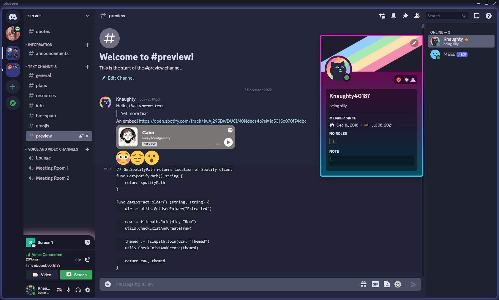

## About
This is theme designed to be lightweight and simple, preserving the orginal look of discord while adding new graphical effects and a smoother colour pallet. With perfomance as the primary goal, this theme should not impact your discord speed while improving the experience. Effort has been taken to make the theme easily customisable, and feel free to edit anything you please.

This theme uses the [catppuccin](https://github.com/catppuccin/catppuccin) Macchiato colour pallet. 

If you do decide to change/add anything (and you want to share), make a pull request ideally or make a issue if there is a bug somewhere. I am open to suggestions and am eager to improve the theme so suggest anything you want.

## Previews

## Usage

1. Have computer
2. install better discord
3. Put theme in better discord theme folder
4. Profit 

## License
Attribution
CC BY
"This license lets others distribute, remix, adapt, and build upon your work, even commercially, as long as they credit you for the original creation."

What this means for you is that if you decide to create your own version of this theme, provide some credit somewhere to me. 
